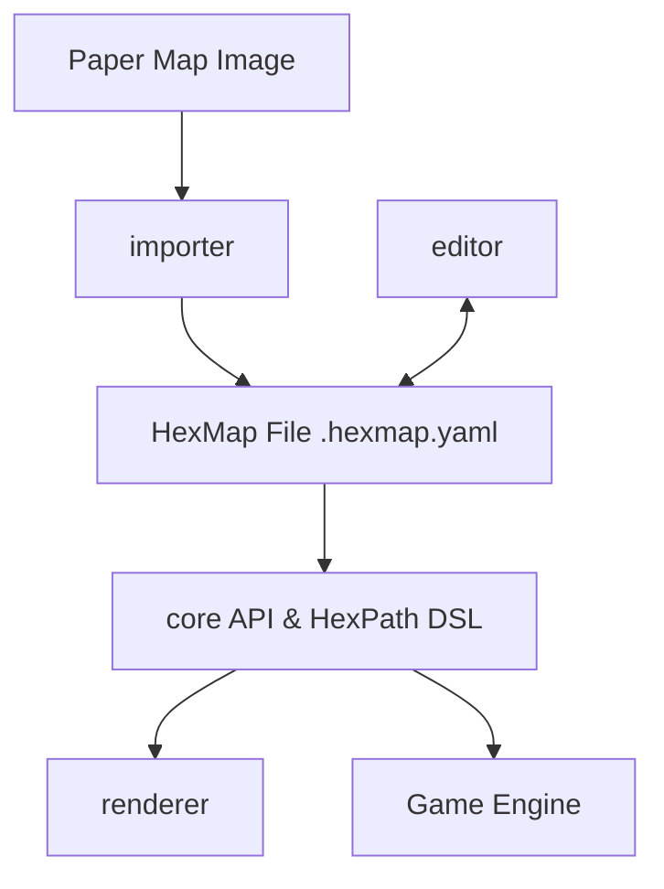

# hexerei

A toolkit for hexagonal wargaming maps.

The **hexerei** project provides a standard interchange format and a suite of tools for working with hexagonal grids, specifically tailored for the needs of wargame designers, digital implementations, and AI analysis.

## Core Components

- **[rfc](./rfc/)**: A language-neutral, human-readable specification for representing hex map data (terrain, geometry, features). It uses JSON/YAML for interchange.
- **[core](./core/)**: The central logic library. It implements the mathematical and topological heavy lifting (coordinate conversions, adjacency) and includes the **HexPath** DSL resolution engine.
- **[importer](./importer/)**: A Python-based computer vision pipeline that detects hex grids in images of physical maps and generates HexMap files.
- **[renderer](./renderer/)**: A flexible rendering engine for converting HexMap data into visual representations (SVG).
- **[editor](./editor/)**: A visual tool for authoring and refining HexMap files.

## Roadmap & Architecture

The project is structured as an NPM Workspace, unifying the TypeScript components under a single build and test pipeline.



### Planned Components
- **Game Engine**: A gameplay-agnostic engine that uses the `core` API to implement movement, LOS, and combat logic.

## Project Structure

This is an NPM workspace monorepo with the following packages:

- **`/core`**: Core API library (`@hexmap/core`)
  - Format types, document serialization/deserialization
  - Hex math (coordinate systems, adjacency, distance)
  - HexPath DSL parser and resolver
  - Hex mesh generation and topology
- **`/canvas`**: Headless canvas model (`@hexmap/canvas`)
  - MapModel (in-memory document representation)
  - Command-based mutations with undo/redo support
  - Selection, viewport, and interaction state
  - Hit testing and hex-path preview
- **`/editor`**: Visual authoring tool (React app)
  - Interactive hex map editor UI
  - Feature inspector and editing
  - Command history with undo/redo (Cmd+Z/Cmd+Shift+Z)
  - Built with Vite + React
- **`/renderer`**: SVG rendering engine (`@hexmap/renderer`)
  - Converts HexMap documents to visual representations
  - D3-based rendering pipeline
- **`/rfc`**: Format specification
  - JSON Schema definitions
  - Documentation and examples
  - HexPath DSL reference
- **`/importer`**: Grid detection pipeline (Python)
  - Computer vision for extracting hex grids from scanned maps
- **`/maps`**: Sample maps and test data
- **`/docs`**: Design documents and implementation plans

## Test Infrastructure

The project uses **Vitest** for unit and integration testing across all TypeScript packages.

### Workspace Configuration

Tests are coordinated via `vitest.workspace.ts`:

```typescript
// vitest.workspace.ts
export default defineWorkspace(['core', 'renderer', 'canvas', 'editor'])
```

Each package has its own `vitest.config.ts` with package-specific settings.

### Path Aliases (Critical!)

**Canvas and editor tests must resolve `@hexmap/core` and `@hexmap/canvas` to TypeScript source files, not compiled JavaScript.**

Why? During development, the `dist/` directories may contain stale `.js`/`.d.ts` artifacts from previous builds. Tests importing from `dist/` can fail or produce confusing errors.

**Solution:** Each package's `vitest.config.ts` includes path aliases:

```typescript
// canvas/vitest.config.ts
export default defineConfig({
  resolve: {
    alias: {
      '@hexmap/core': path.resolve(__dirname, '../core/src/index.ts')
    }
  },
  test: { environment: 'node' }
})

// editor/vitest.config.ts  
export default defineConfig({
  plugins: [react()],
  resolve: {
    alias: {
      '@hexmap/core': path.resolve(__dirname, '../core/src/index.ts'),
      '@hexmap/canvas': path.resolve(__dirname, '../canvas/src/index.ts')
    }
  },
  test: {
    environment: 'jsdom',
    setupFiles: ['./src/test-setup.ts'],
    globals: true,
    css: true
  }
})
```

### Running Tests

```bash
# Run all tests (from workspace root)
npm test

# Run tests for a specific package
npm test --workspace=core
npm test --workspace=canvas
npm test --workspace=editor

# Watch mode (in package directory)
cd editor && npm run test:watch
```

### Stale Artifact Prevention

The following patterns are gitignored to prevent stale build artifacts:

```gitignore
# In core/src/, canvas/src/ - ignore compiled JS/declaration files
core/src/**/*.js
core/src/**/*.d.ts
canvas/src/**/*.js
canvas/src/**/*.d.ts

# dist/ directories are build output only
dist/
```

## Code Quality

### Linting & Formatting

The project uses **ESLint** (Airbnb config) + **Prettier** for code quality:

```bash
# Lint all packages
npm run lint

# Auto-fix issues
npm run lint:fix

# Format code
npm run format

# Check formatting
npm run format:check
```

### Type Checking

```bash
# Build all packages (runs tsc)
npm run build
```
