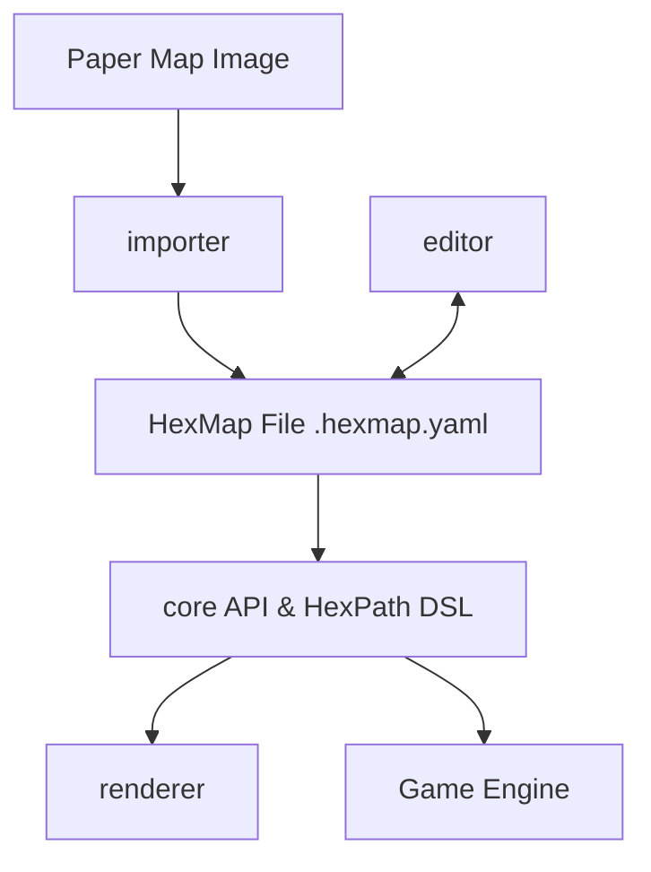

# hexerei

A toolkit for hexagonal wargaming maps.

The **hexerei** project provides a standard interchange format and a suite of tools for working with hexagonal grids, specifically tailored for the needs of wargame designers, digital implementations, and AI analysis.

## Core Components

- **[rfc](./rfc/)**: A language-neutral, human-readable specification for representing hex map data (terrain, geometry, features). It uses JSON/YAML for interchange.
- **[core](./core/)**: The central logic library. It implements the mathematical and topological heavy lifting (coordinate conversions, adjacency) and includes the **HexPath** DSL resolution engine.
- **[importer](./importer/)**: A Python-based computer vision pipeline that detects hex grids in images of physical maps and generates HexMap files.
- **[renderer](./renderer/)**: A flexible rendering engine for converting HexMap data into visual representations (SVG).
- **[editor](./editor/)**: A visual tool for authoring and refining HexMap files.

## Roadmap & Architecture

The project is structured as an NPM Workspace, unifying the TypeScript components under a single build and test pipeline.

### Planned Components
- **Game Engine**: A gameplay-agnostic engine that uses the `core` API to implement movement, LOS, and combat logic.

## Project Structure

- `/core`: Core API implementation, math, and HexPath DSL (TypeScript).
- `/renderer`: Rendering components (TypeScript/Vite).
- `/editor`: Visual Map Editor (React/TypeScript).
- `/rfc`: Format specification and JSON Schema.
- `/importer`: Grid detection and ingestion pipeline (Python).
- `/maps`: Centralized collection of physical map images and HexMap definitions.
- `/docs`: High-level design documents and RFCs.
- `/conductor`: Track plans and project management.
